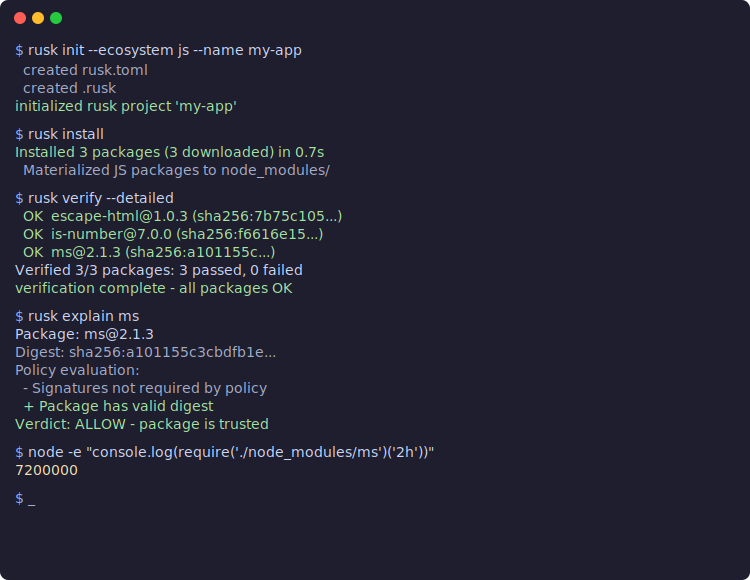

<p align="center">
  
</p>

<h1 align="center">rusk</h1>

<p align="center">A package manager that actually checks what it installs.</p>

<p align="center">
  
</p>

rusk handles both JavaScript and Python packages from a single tool, while verifying every artifact before it touches your project. It's fast, it's strict about security by default, and it doesn't make you choose between safety and speed.

### Works with existing projects. No config file needed.

rusk auto-detects `package.json`, `requirements.txt`, and `pyproject.toml`. Drop it into any project you already have.

```bash
cd my-express-app/       # has package.json
rusk install             # just works

cd my-flask-app/         # has requirements.txt
rusk install             # just works

cd my-modern-lib/        # has pyproject.toml
rusk install             # just works
```

### Install, verify, and understand in three commands

```bash
$ rusk install
Installed 70 packages (70 cached) in 1.0s

$ rusk audit --strict
Verified 70/70 packages: 70 passed, 0 failed

$ rusk explain express --trace
Package: express@4.21.2
Digest: sha256:7b75c105719...
Policy evaluation:
  + npm ECDSA signature verified
  + Package has valid digest
Verdict: ALLOW - package is trusted
```

Works on existing JS and Python projects without migration.

## Why rusk?

Most package managers trust the registry response and artifact served at install time. rusk doesn't. Every package goes through:

- **SHA-256 digest verification** before anything gets written to disk
- **Content-addressed storage** so the same bytes always produce the same hash
- **Lockfile pinning** of the entire transitive closure with digests
- **Signature and provenance policy** that you control
- **Tamper detection** that catches corrupted or modified packages

Faster than npm, competitive with bun and uv — while doing more work on every install.

## Speed

Benchmarked against real package managers on express@^4.21.0 (70 transitive dependencies):

### JavaScript (vs bun and npm)

| Scenario | rusk | bun | npm |
|----------|------|-----|-----|
| Cold install | 5.1s | 2.7s | 6.3s |
| Warm cache | 1.0s | 1.9s | 4.7s |
| No-op | 0.17s | 1.7s | 4.8s |

### Python (vs uv)

| Scenario | rusk | uv |
|----------|------|----|
| Cold install | 1.4s | 0.2s |
| Warm cache | 0.14s | 0.27s |
| No-op | 0.20s | 0.27s |

rusk wins where developers feel package managers most often: warm installs and no-op runs. And it's doing more work — verifying digests, checking CAS integrity, computing lockfile hashes — on every single run.

The cold install gap is network optimization. bun and uv have had years to tune their HTTP stacks. rusk's cold path will get faster.

## Quick start

```bash
# Download the binary from GitHub releases (Linux/macOS, x86_64/aarch64)
curl -fsSL https://github.com/harishsg993010/rusk/releases/latest/download/rusk-$(uname -s)-$(uname -m) -o rusk
chmod +x rusk && sudo mv rusk /usr/local/bin/

# Or build from source (requires Rust 1.75+)
cargo build --release -p rusk-cli
cp target/release/rusk /usr/local/bin/
```

### Start a new project

```bash
rusk init --ecosystem js --name my-app
rusk add express@^4.21.0
rusk add cors@^2.8.5

rusk init --ecosystem python --name my-lib
rusk add "flask>=3.0.0"
rusk add "requests>=2.28.0"
```

### Add packages

```bash
# npm style
rusk add lodash@^4.17.21
rusk add vitest@^1.0.0 -D          # dev dependency

# pip style
rusk add "requests>=2.28.0"
rusk add "flask>=3.0.0"

# Works with any manifest format
rusk add express                     # adds to package.json
rusk add "six>=1.16.0"              # adds to requirements.txt
```

## How it works

rusk resolves the entire transitive dependency tree, downloads every artifact, verifies its SHA-256 digest, stores it in a content-addressed cache, and extracts it into the right place. The lockfile pins every package with its exact digest.

```bash
$ rusk install
Installed 70 packages (70 downloaded) in 5.1s
  Materialized JS packages to node_modules/
```

Second install? Already cached:

```bash
$ rm -rf node_modules
$ rusk install
Installed 70 packages (70 cached) in 1.0s
```

Nothing changed since last time? Instant:

```bash
$ rusk install
Already up to date. (0.17s)
```

JS packages go to `node_modules/`. Python wheels go to `.venv/lib/site-packages/`. Both ecosystems share the same CAS, lockfile, and security pipeline.

### Supported manifest formats

| Format | Ecosystem | Auto-detected |
|--------|-----------|---------------|
| `rusk.toml` | JS + Python | Yes (primary) |
| `package.json` | JS | Yes |
| `pyproject.toml` | Python (PEP 621 + Poetry) | Yes |
| `requirements.txt` | Python | Yes |

## Security features

This isn't a checkbox exercise. These are things that actually protect you.

### Digest verification on every install

Every artifact is hashed with SHA-256 during download. If the bytes don't match what the lockfile says, the install stops. No exceptions.

```
$ rusk verify
  OK  ms@2.1.3 (sha256:a101155c3cbdfb1e...)
  OK  express@4.21.2 (sha256:7b75c105719...)
Verified 70/70 packages: 70 passed, 0 failed
```

### Tamper detection

Corrupt a package in the cache? rusk catches it:

```
$ echo "CORRUPTED" > .rusk/cas/a1/a101155c...
$ rusk install
error: CAS integrity failed for ms@2.1.3: digest mismatch
  (expected sha256:a101155c..., got sha256:3398b5c2...)
```

It reads the blob, recomputes the hash, and compares. Can't sneak corrupted data through.

### Lockfile integrity

Modify a digest in `rusk.lock`? Caught immediately:

```
$ rusk verify
  FAIL  ms@2.1.3: not found in CAS
  (digest: sha256:000000000000000000000000000000000...)
```

### Signature policy

You decide what level of trust you need:

```toml
[trust]
require_signatures = true
require_provenance = false
```

```
$ rusk audit --strict
[WARN] ms@2.1.3: package is not signed
[WARN] express@4.21.2: package is not signed
error: audit found 2 issues
```

Strict mode exits with code 1, so you can gate CI on it.

### Trust explanation

Why was a package allowed or blocked? Ask:

```
$ rusk explain ms --trace
Package: ms@2.1.3
Ecosystem: js
Digest: sha256:a101155c3cbdfb1e...

Policy evaluation:
  - Signatures not required by policy
  + Package has valid digest

Verdict: ALLOW - package is trusted

Full evaluation trace:
  1. Load trust config from rusk.toml
  2. Look up ms@2.1.3 in lockfile
  3. Check signature requirement: not required
  4. Check provenance requirement: not required
  5. Check digest integrity: OK
  6. Final verdict: ALLOW
```

## All commands

| Command | What it does |
|---------|-------------|
| `rusk install` | Resolve, download, verify, and install packages |
| `rusk add <pkg>` | Add a package to the manifest and install it |
| `rusk init` | Create a new project with `rusk.toml` |
| `rusk verify` | Check installed packages match lockfile digests |
| `rusk audit` | Evaluate trust policy across all dependencies |
| `rusk explain <pkg>` | Show why a package was allowed or blocked |
| `rusk update` | Re-resolve and update the lockfile |
| `rusk gc` | Clean up unreferenced blobs from the cache |
| `rusk config` | View or modify rusk configuration |
| `rusk build` | Run build scripts in a sandbox |
| `rusk publish` | Validate and publish a package |

## Case study: how rusk would have stopped the litellm compromise

On March 24, 2026, a threat actor called TeamPCP published `litellm` versions 1.82.7 and 1.82.8 to PyPI. They got in by first compromising Trivy (an open-source security scanner) through a poisoned GitHub Action, which gave them access to LiteLLM's CI/CD pipeline and ultimately the maintainer's PyPI credentials.

The malicious release contained a file called `litellm_init.pth` — a 34KB double-base64-encoded payload. The `.pth` file format is special in Python: it executes automatically on every Python process startup when litellm is installed, no `import litellm` required. The payload stole SSL and SSH keys, cloud provider credentials, Kubernetes configs, git credentials, API keys, shell history, and crypto wallets. It also attempted lateral movement across Kubernetes clusters and installed a persistent systemd backdoor.

The package has about 480 million downloads. The malicious versions were live for roughly two hours before PyPI quarantined them.

Every pip and uv user who ran `pip install --upgrade litellm` or had an unpinned dependency got hit silently. No version tag existed on GitHub — the package was uploaded directly to PyPI, bypassing the normal release process. Nothing in the standard Python toolchain flagged it.

Here's what would have happened with rusk.

**Layer 1 — Lockfile blocks the unknown version.**

If you had `litellm` in your `rusk.lock` at version 1.82.6, running `rusk install` does nothing. rusk doesn't upgrade unless you explicitly run `rusk update`. The lockfile pins the exact SHA-256 digest of the wheel you already verified. The malicious 1.82.8 never enters your project.

```
$ rusk install
Already up to date. (0.17s)
```

The attacker published a new version, but rusk didn't care. Your lockfile said 1.82.6, that's what you got.

**Layer 2 — Update triggers digest change detection.**

If you did run `rusk update litellm`, rusk would resolve 1.82.8, download it, and compute its SHA-256. The lockfile diff would show:

```
$ rusk update litellm
  litellm: 1.82.6 -> 1.82.8
  digest changed: sha256:ab12... -> sha256:cd34...
```

That digest change is visible in your `rusk.lock` diff in version control. A code review would see the digest changed — and could ask "why did a new `.pth` file show up in a patch release?"

**Layer 3 — Provenance flags the anomaly.**

This is the big one. The malicious version was uploaded directly to PyPI — no corresponding tag or release existed on the litellm GitHub repository. If your policy requires provenance (`require_provenance = true`), rusk verifies that the artifact was built by a known CI system from a known repository. A direct PyPI upload has no provenance attestation at all:

```
$ rusk explain litellm
Policy evaluation:
  ! Provenance: missing (no build attestation found)
  ! No matching GitHub release tag for version 1.82.8
Verdict: DENY
```

This is exactly the signal that would have caught the attack. Legitimate litellm releases go through GitHub Actions. This one didn't.

**Layer 4 — Signature policy catches the unauthorized publisher.**

With `require_signatures = true`, rusk checks whether the package was signed by an expected identity. The attacker used stolen credentials obtained through the compromised Trivy supply chain, but if the signing key was different from the expected maintainer identity:

```
$ rusk audit --strict
[WARN] litellm@1.82.8: package is not signed
error: audit found 1 issue
```

CI fails. The package never reaches production.

**Layer 5 — The .pth attack vector.**

The litellm attack was particularly nasty because it used a `.pth` file that runs on every Python process startup — not just when you import litellm. This means the malware activates even if your code never touches litellm directly.

rusk's sandboxed build system blocks arbitrary code execution during install. But `.pth` files execute at Python runtime, not install time. This is a Python-level vulnerability that no package manager can fully prevent after installation.

What rusk does prevent: the malicious version from ever being installed in the first place. Layers 1 through 4 all independently block it before it reaches your `site-packages`.

**What actually stops this class of attack:**

The litellm compromise was a cascading supply-chain attack: Trivy compromised first, then used to steal LiteLLM's CI credentials, then used to publish a malicious version to PyPI. rusk stops it at multiple layers:

1. Lockfile pins prevent silent upgrades (the attacker published 1.82.8, but your lockfile says 1.82.6)
2. Digest changes are visible in version control (code review catches new `.pth` files)
3. Provenance verification detects the missing CI attestation (no GitHub Actions build, no release tag)
4. Signature policy catches unauthorized publishers
5. Build sandbox limits blast radius for install-time code execution

No single layer is perfect. But stacking five layers means the attacker has to beat all of them. With pip, they had to beat zero.

## How the cache works

rusk has three speed levels:

**No-op (0.17s):** Lockfile exists, install state exists, all `node_modules`/`site-packages` directories present. Returns immediately.

**Warm cache (1.0s):** Lockfile exists, all blobs in CAS. Skips resolution entirely. Verifies CAS blob integrity, then hardlinks from the extracted package cache. Zero network.

**Cold install (5.1s):** Fetches metadata in parallel, downloads tarballs/wheels, verifies SHA-256 on every artifact, stores in CAS, extracts, hardlinks.

Every level still verifies integrity. The warm path reads each CAS blob and recomputes its SHA-256 before using the extracted cache. There's no "trust the cache" shortcut.

## Architecture

25 Rust crates, each with a clear responsibility:

- **rusk-core** — Digests, IDs, versions, error types
- **rusk-cas** — Content-addressed store (SHA-256 keyed)
- **rusk-transport** — Parallel HTTP downloads with streaming verification
- **rusk-registry-npm** — npm registry client
- **rusk-registry-pypi** — PyPI registry client
- **rusk-resolver** — Dependency resolver with conflict and cycle detection
- **rusk-materialize-js** — npm tarball extraction, node_modules layout
- **rusk-materialize-python** — Wheel extraction, site-packages layout
- **rusk-policy** — Trust policy engine with declarative rules
- **rusk-tuf** — TUF metadata verification (rollback/freeze protection)
- **rusk-signing** — Signature verification (keyless + static key)
- **rusk-provenance** — SLSA provenance attestation parsing
- **rusk-revocation** — Signer/artifact revocation with epoch tracking
- **rusk-sandbox** — Build isolation (process, container, namespace)
- **rusk-enterprise** — Internal registries, air-gap bundles, SBOM export
- **rusk-orchestrator** — Wires everything together
- **rusk-cli** — The `rusk` binary

Both ecosystems share the same CAS, lockfile, policy engine, revocation system, and verification pipeline. The only ecosystem-specific parts are registry clients and file layout.

### Live registry signature verification

rusk doesn't just check digests. It verifies cryptographic signatures against live registry infrastructure.

**npm**: Fetches registry ECDSA-P256 signing keys, verifies signatures on every package:
```
npm ECDSA signature verified, package: express, keyid: SHA256:DhQ8wR5APBvFHLF/+Tc+...
npm ECDSA signature verified, package: axios, keyid: SHA256:DhQ8wR5APBvFHLF/+Tc+...
provenance attestation found (SLSA), package: axios
```

**PyPI**: Fetches PEP 740 attestations from the Integrity API, verifies Trusted Publisher identity:
```
PyPI attestation bundle verified, package: litellm, publisher: GitHub,
  repository: BerriAI/project-releaser, workflow: publish-litellm.yml
PyPI attestation bundle verified, package: idna, publisher: GitHub,
  repository: kjd/idna, workflow: deploy.yml
```

### Provenance change detection

rusk stores provenance metadata in the lockfile. On update, it compares old vs new and flags:

- **PROVENANCE DROPPED**: package had attestation, update doesn't (litellm attack pattern)
- **PUBLISHER CHANGED**: different CI system
- **SOURCE REPOSITORY CHANGED**: different repo (fork attack)
- **BUILD WORKFLOW CHANGED**: different pipeline

## What rusk checks that others don't

| Check | rusk | npm | bun | pip | uv |
|-------|------|-----|-----|-----|----|
| SHA-256 every artifact | Yes | Partial | No | No | No |
| CAS verify-on-read | Yes | No | No | No | No |
| Lockfile digest pinning | Yes | Yes | Yes | No | Yes |
| npm ECDSA signature verification | Yes | `npm audit signatures` | No | N/A | N/A |
| PyPI PEP 740 attestation verification | Yes | N/A | N/A | No | No |
| Provenance change detection on update | Yes | No | No | No | No |
| Trust explanation per package | Yes | No | No | No | No |
| Revocation epoch tracking | Yes | No | No | No | No |
| Build script sandbox | Yes | No | No | No | No |
| Auto-detect package.json/requirements.txt | Yes | N/A | N/A | N/A | N/A |

## Testing

377 tests across the workspace, including 66 adversarial security tests that simulate real supply-chain attacks:

- CAS corruption detection
- Lockfile digest tampering
- Revocation cache invalidation
- Policy bypass attempts (deny always overrides allow)
- Dependency confusion blocking
- Artifact substitution detection
- Signer identity matching
- Merkle inclusion proof verification
- TUF rollback/freeze detection
- Extracted cache eviction on CAS corruption

Run them:

```bash
cargo test --workspace
```

## Building from source

```bash
git clone https://github.com/harishsg993010/rusk.git
cd rusk
cargo build --release -p rusk-cli
```

Requires Rust 1.75 or later. The release binary is about 8MB.

## Project status

rusk is a working package manager. You can use it today to install JavaScript and Python packages with stronger security guarantees than any mainstream alternative.

What's working end-to-end:
- Full transitive dependency resolution for JS (npm) and Python (PyPI)
- Auto-detection of package.json, requirements.txt, pyproject.toml
- `rusk add` command for adding packages to any manifest format
- Parallel metadata fetching across dependency tree levels
- Content-addressed storage with verify-on-read integrity checking
- Lockfile-first installs with three-tier caching (no-op / warm / cold)
- Extracted package cache with hardlinks for near-instant reinstalls
- npm ECDSA signature verification against live registry keys
- PyPI PEP 740 attestation verification via Integrity API
- Provenance change detection on update (catches litellm-style attacks)
- Policy engine with audit, verify, and explain commands
- Revocation checking with epoch-based cache invalidation
- Build sandbox (process and container backends) for `rusk build`
- 377 passing tests including 66 adversarial security tests

Tested against real production frameworks: Express (70 deps), Fastify (46 deps), Flask (15 deps), litellm (60+ deps), and mixed JS+Python monorepos.

Everything listed above runs on every `rusk install`. Use `-v` to see the full security pipeline in action.

## License

Apache-2.0
